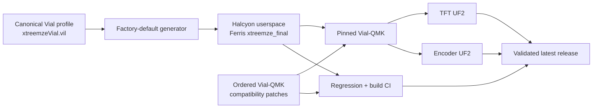

# Halcyon Ferris Firmware

A production-oriented **Vial/QMK userspace for the splitkb Halcyon Ferris**, built around deterministic input behavior, persistent configuration, a purpose-built TFT interface, and an auditable firmware release process.

[](https://github.com/xtreemze/qmk_userspace/actions/workflows/build_binaries.yaml)
[](https://github.com/xtreemze/qmk_userspace/releases/tag/latest)
[](https://get.vial.today/)

<p align="center">
  
</p>

<p align="center">
  <a href="https://github.com/xtreemze/qmk_userspace/releases/tag/latest"><strong>Firmware</strong></a>
  ·
  <a href="keyboards/splitkb/halcyon/ferris/keymaps/xtreemze_final/readme.md"><strong>Ferris keymap</strong></a>
  ·
  <a href="keyboards/splitkb/halcyon/ferris/keymaps/xtreemze_final/xtreemzeVial.vil"><strong>Vial profile</strong></a>
  ·
  <a href="docs/PROJECT_STATUS.md"><strong>Project status</strong></a>
  ·
  <a href="docs/README.md"><strong>Documentation</strong></a>
</p>

---

## What this repository is

This is a maintained fork of the SplitKB Halcyon QMK userspace. The broader Halcyon keyboard/module support remains available, but the active production firmware in this fork is the **Ferris rev1 `xtreemze_final` profile**.

The project treats the keyboard as a small embedded system rather than a static keymap. Behavior that is important in daily use is made explicit, versioned, tested where possible, and separated from hardware claims that CI cannot prove.

The two release targets are:

| Half / module | Build target | Release artifact |
| --- | --- | --- |
| TFT half | `HLC_TFT_DISPLAY=1` | `splitkb_halcyon_ferris_rev1_xtreemze_final_display.uf2` |
| Encoder half | `HLC_ENCODER=1` | `splitkb_halcyon_ferris_rev1_xtreemze_final_encoder.uf2` |

Both targets use the same canonical Vial profile and shared firmware policy. They differ only where module hardware requires it.

## What is different here

| Area | This fork |
| --- | --- |
| **Configuration** | Canonical Vial export is committed, compiled into firmware defaults, and checked for drift. |
| **Layers** | 13 matrix layers with encoder behavior compiled for every layer. |
| **Encoder Repeat** | Repeat / Alternate Repeat direction is deterministic for bidirectional Vial pairs instead of depending on which member was pressed last. |
| **TFT** | Layer-specific labels and procedural animated motifs, host/diagnostic surfaces, and module-aware state. |
| **Backlight** | Persistent TFT brightness/toggle behavior with synchronized split handling and transient suspend/idle blanking. |
| **RGB state** | Persistent per-layer, modifier and chord profiles exposed through Vial custom keycodes. |
| **Host shortcuts** | Guarded OS-family detection for Apple-vs-Ctrl shortcut behavior rather than immediately trusting transient detector output. |
| **Persistence** | Factory seeding, user data and migration behavior are documented and regression-checked where practical. |
| **Dependencies** | Release-producing Vial-QMK and build tooling are pinned; fork-specific compatibility changes live as ordered patches. |
| **Validation** | Source regressions, exact firmware builds, resource reporting and physical hardware acceptance are treated as separate evidence classes. |
| **Releases** | CI validates the exact UF2 set before updating the moving `latest` release. |

For implementation details, see the [Ferris keymap documentation](keyboards/splitkb/halcyon/ferris/keymaps/xtreemze_final/readme.md).

## Firmware architecture



The repository is the source of truth for both the human-editable configuration and the generated/compiled defaults. Fork patches are intentionally separate from userspace code so their responsibility and eventual retirement remain auditable.

## Daily layer workflow

Although the profile contains 13 layers, they are not intended to be treated as 13 equal modes. **Layer 1 (`QWERTY`) is the normal everyday working layer and the place to return for alpha typing.** Layer 0 is primarily a mouse/control hub, while the most frequently reached transient layers are 3, 6 and 7.

A typical editing session looks like this:

1. **Type on layer 1.** The alpha keys live here, with a dedicated right-thumb Space. The thumb Backspace keys are dual-role `LT(3, KC_BSPC)` keys: tap for Backspace, hold for layer 3.
2. **Hold a Backspace thumb for numbers and common numeric work.** Layer 3 (`NUMSYMS`) places `1–5` on the left and `6–0` on the right, adds keypad-style digits/operators, Escape and Shift+Tab, and changes the right encoder to deterministic Repeat / Alternate Repeat.
3. **Hold the layer-6 thumb for editing and modifiers.** Layer 6 (`EDITING`) exposes one-shot Ctrl/GUI/Shift/Alt combinations, Caps Word, custom shortcut functions and access to the modifier/symbol sublayers without abandoning the alpha home position.
4. **Use the `F+D` or `J+K` combo for momentary layer 7.** Layer 7 (`FNSYMS`) is the function/navigation surface: F1–F12, brackets and common symbols, plus the Up/Left/Right/Down tap-dance navigation cluster. The right encoder performs GUI `-` / `+`, useful for application zoom where supported.
5. **Use direct QWERTY combos for high-frequency actions.** `S+D` sends Escape and `K+L` sends Enter, keeping both actions on the home typing layer without dedicating full-size keys to them.

The layout therefore favors **brief layer holds and home-row chords over persistent mode switching**. Most text entry should begin and remain on layer 1; secondary layers are brought in for the duration of an action and then released.

### Layer hierarchy

| Layer | TFT label | Typical use | Access pattern |
| ---: | --- | --- | --- |
| 0 | `MOUSE` | Mouse movement/buttons, diagnostics and direct access to specialist controls | Explicit control layer; `TO(1)` returns to typing |
| **1** | **`QWERTY`** | **Primary alpha typing and everyday home state** | **Normal working layer** |
| 2 | `COLEMAK` | Alternate alpha layout | Alternate typing mode |
| **3** | **`NUMSYMS`** | **Numbers, keypad, Escape/Shift-Tab and encoder Repeat** | **Hold either layer-tap Backspace** |
| 4 | `NUMFLIP` | Mirrored number arrangement; RGB saturation on encoder | Toggle from layer 3 when useful |
| 5 | `ONESHOT` | One-shot modifier combinations | Reached through the editing-layer workflow |
| **6** | **`EDITING`** | **Modifiers, Caps Word, shortcuts/macros and sublayer access** | **Momentary thumb hold from layer 1** |
| **7** | **`FNSYMS`** | **F-keys, brackets/symbols and directional navigation** | **`F+D` or `J+K` momentary combo** |
| 8 | `FNFLIP` | Mirrored function-key arrangement; RGB speed | Specialist/alternate function layout |
| 9 | `SYMBOLS` | Shifted number-row symbols; RGB mode | Momentary specialist symbol layer |
| 10 | `RGBHUE` | RGB hue adjustment | Control-layer access |
| 11 | `RGBVAL` | RGB value/brightness adjustment | Control-layer access |
| 12 | `BKLIGHT` | Halcyon TFT backlight level/toggle controls | Control-layer access |

### Frequently used controls

| Action | Normal interaction |
| --- | --- |
| Type letters | Layer 1 |
| Space | Right thumb on layer 1 |
| Backspace | Tap either `LT(3, KC_BSPC)` thumb |
| Numbers | Hold a Backspace thumb for layer 3, then press the number |
| Escape | `S+D` combo on the alpha layer |
| Enter | `K+L` combo on the alpha layer |
| Editing modifiers / Caps Word | Hold layer 6 and select the one-shot/editing action |
| Arrow navigation / F-keys | Hold `F+D` or `J+K` to expose layer 7 |
| Volume | Left encoder on the normal working layers |
| Scroll | Right encoder on layer 1 |
| Repeat / Alternate Repeat | Right encoder on layer 3; direction remains deterministic for configured bidirectional pairs |
| Mouse control | Switch to layer 0; use `TO(1)` to return to the alpha workflow |
| TFT backlight | Layer 12, with either encoder adjusting the backlight level |

The full Vial configuration also includes macros, tap dance, combos, key overrides, Alternate Repeat entries and QMK settings. The committed `.vil` file is the canonical editable profile; the generated firmware defaults are derived from it.

## Deterministic encoder Repeat

One of the central behavioral changes in this fork is a predictable encoder contract for Vial Alternate Repeat pairs.

For a Vial pair such as:

```text
Key:     Up
Alt Key: Down
```

encoder direction remains tied to the pair orientation rather than the last direction pressed:

```text
CW  -> Vial primary / Key side
CCW -> Vial alternate / Alt Key side
```

This removes the direction reversal that normally occurs when Repeat semantics are driven only by the remembered last key. The implementation still uses QMK/Vial Repeat semantics; it adds a deterministic resolver for encoder-originated requests.

## TFT, backlight and runtime behavior

The TFT is a first-class firmware surface rather than a static logo display. It provides layer identity, animated procedural geometry and diagnostic/status views while keeping display work out of timing-sensitive wake callbacks.

Backlight control uses the Halcyon TFT PWM path with persistent QMK brightness state. Idle and suspend blanking are transient: the saved level and explicit on/off state are restored when appropriate rather than rewritten on every sleep cycle.

Because backlight behavior participates in split synchronization, **both halves should be flashed together when using this firmware line**.

Physical behavior such as split reconnect, either-half USB master operation, suspend/resume and exact TFT electrical behavior is tracked separately from source/build validation. See the [project status](docs/PROJECT_STATUS.md) and hardware-validation issues for the current acceptance boundary.

## Download and flash

The moving [`latest` release](https://github.com/xtreemze/qmk_userspace/releases/tag/latest) publishes the two production UF2 files only after the regression and build jobs succeed and the release job verifies the expected artifact set.

Use:

- `*_display.uf2` for the half fitted with the Halcyon TFT module;
- `*_encoder.uf2` for the half fitted with the Halcyon rotary encoder module.

> **Before flashing:** read the [Ferris keymap migration note](keyboards/splitkb/halcyon/ferris/keymaps/xtreemze_final/readme.md). Intentional factory-profile revisions can reseed Vial dynamic data on first boot. Export any newer on-device Vial edits before flashing a firmware revision that changes the factory marker.

The firmware does not require a manual EEPROM reset for the current factory-profile migration path.

## Build locally

This repository is a QMK userspace overlay. For an exact local build, use the same Vial-QMK revision and compatibility patches as CI.

```bash
# Clone userspace
git clone -b halcyon https://github.com/xtreemze/qmk_userspace.git
cd qmk_userspace

# Clone and pin the firmware dependency used by release CI
git clone --recursive https://github.com/vial-kb/vial-qmk qmk_firmware
git -C qmk_firmware checkout dd43959ae5c08d8a28d38a1acf7b04e86b14a344
git -C qmk_firmware submodule update --init --recursive

# Configure QMK to use this repository as an overlay
qmk config user.qmk_home="$(realpath qmk_firmware)"
qmk config user.overlay_dir="$(realpath .)"

# Apply the fork's ordered compatibility patches
bash scripts/apply-qmk-patches.sh qmk_firmware

# Build both production targets
qmk userspace-compile
```

The exact targets declared in `qmk.json` are equivalent to:

```bash
qmk compile -kb splitkb/halcyon/ferris/rev1 -km xtreemze_final \
  -e HLC_TFT_DISPLAY=1 \
  -e TARGET=splitkb_halcyon_ferris_rev1_xtreemze_final_display

qmk compile -kb splitkb/halcyon/ferris/rev1 -km xtreemze_final \
  -e HLC_ENCODER=1 \
  -e TARGET=splitkb_halcyon_ferris_rev1_xtreemze_final_encoder
```

For release-equivalent dependency details, consult `.github/workflows/build_binaries.yaml` rather than assuming the current head of Vial-QMK is compatible.

## Validation

Run the repository-level source regression suite with:

```bash
bash tests/run_ci_regressions.sh
```

The CI pipeline also builds both exact production targets and reports retained firmware resource usage.

A successful source test or firmware build is **not** treated as proof of physical hardware behavior. The project distinguishes:

1. **source-level regression evidence** — deterministic tests over repository behavior;
2. **build evidence** — successful compilation of the exact release targets against the pinned firmware dependency;
3. **binary evidence** — explicit artifact/hash/equivalence checks when required;
4. **hardware evidence** — observations from the actual split keyboard, modules, USB lifecycle and persistent state.

This distinction is intentional: USB resume, split transport, display electronics and persistent state across real power cycles cannot be certified by a mocked unit test alone.

## Repository map

```text
.
├── keyboards/splitkb/halcyon/ferris/keymaps/xtreemze_final/
│   ├── keymap.c                 # Ferris firmware implementation + generated defaults
│   ├── xtreemzeVial.vil         # canonical editable Vial profile
│   ├── vial.json                # Vial device definition
│   ├── config.h / rules.mk      # target configuration
│   └── readme.md                # detailed firmware behavior and build notes
├── users/halcyon_modules/       # reusable SplitKB Halcyon module support
├── patches/                     # ordered patches for the pinned firmware tree
├── scripts/                     # generation, validation, release and hardware-evidence tooling
├── tests/                       # standalone regression suite
├── docs/                        # project guide, status, migration and dependency records
├── qmk.json                     # exact production target declaration
└── .github/workflows/           # pinned build / validation / release pipeline
```

## Project documentation

Start with the [documentation index](docs/README.md).

- [Project guide](docs/PROJECT_GUIDE.md) — sources of truth, collaboration model, validation policy, upstream synchronization and risk management.
- [Project status](docs/PROJECT_STATUS.md) — current audit snapshot, integrated work and open priorities.
- [Ferris firmware notes](keyboards/splitkb/halcyon/ferris/keymaps/xtreemze_final/readme.md) — profile migration, TFT identities, backlight behavior, RGB keys, host policy and exact build commands.
- [Related projects](docs/RELATED_PROJECTS.md) — QMK, Vial and SplitKB upstream relationships and dependency-watch policy.
- [Module documentation](docs/MODULES.md) — reusable Halcyon module behavior.
- [Porting guide](docs/PORTING.md) — adding Halcyon module support to compatible boards/keymaps.
- [Fork patch policy](patches/README.md) — compatibility patches applied to the pinned firmware dependency.

## Upstream Halcyon support

This fork still contains the broader SplitKB Halcyon userspace for boards such as Kyria, Elora, Corne, Ferris and Lily58, plus supported Aurora boards through the Halcyon converter. It also retains support for the TFT, rotary encoder and Cirque module families.

For a general-purpose Halcyon userspace rather than this Ferris production firmware, prefer the upstream [splitkb/qmk_userspace](https://github.com/splitkb/qmk_userspace) project and use this fork only where its additional behavior is specifically required.

## Development model

`halcyon` is the integration branch. Changes are expected to arrive through focused pull requests; durable research, risks, hardware observations and decisions belong in Issues.

The repository is designed for parallel human/AI execution:

- keep PRs narrow and independently reviewable;
- do not rewrite shared integration history;
- preserve upstream architecture unless a fork-specific divergence is intentional and documented;
- update user-facing documentation with behavior changes;
- record hardware acceptance separately from automated claims;
- prefer deterministic checks for values that can be derived from source.

See [PROJECT_GUIDE.md](docs/PROJECT_GUIDE.md) for the complete working agreement.

## Lineage

This repository builds on:

- [QMK Firmware](https://github.com/qmk/qmk_firmware) — keyboard firmware platform;
- [Vial-QMK](https://github.com/vial-kb/vial-qmk) — runtime configuration and dynamic keymap features;
- [SplitKB QMK userspace](https://github.com/splitkb/qmk_userspace) — Halcyon controller/module and keyboard integration.

The fork-specific goal is not to replace those projects. It is to keep one concrete Halcyon Ferris configuration **predictable, inspectable and maintainable** as firmware behavior becomes more sophisticated.
