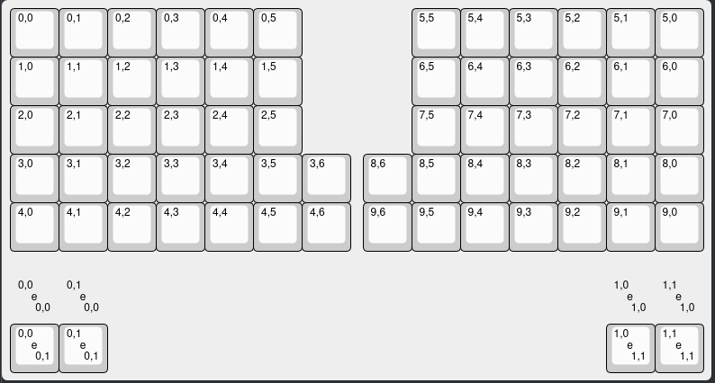
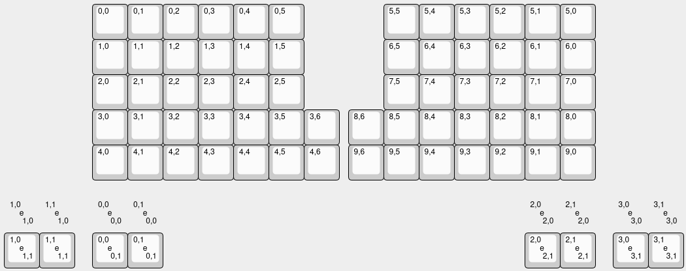
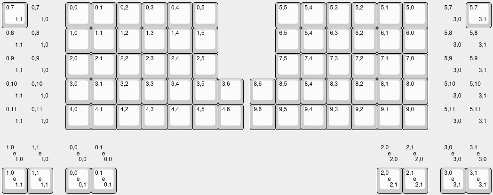

# Porting a Keyboard for Halcyon Module Support

Ensure the setup in the main [README](README.md) is completed before proceeding.

This guide applies to:

* Keyboards with a **Halcyon + VIK connector**
* Keyboards using the **Halcyon → Pro Micro adapter**

## 1. Enable Halcyon Modules in Your Keymap

Copy or create your keymap in this repository.

In your keymap directory, update or create `rules.mk`:

```make
USER_NAME := halcyon_modules
```

If using the Halcyon → Pro Micro adapter, also add:

```make
CONVERT_TO = halcyon
```

## 2. Configure Encoder Support

Edit:

```
users/halcyon_modules/splitkb/config.h
```

The Halcyon encoder adds extra encoder pins to the keyboard's existing encoder definition. Because QMK's encoder API does not currently support appending encoder pins from userspace, the complete encoder pin list must be overridden. The first part will be the existing pin values from the `keyboard.json` of your keyboard, you wil then appand `HLC_ENCODER_A` and `HLC_ENCODER_B` respectively. 

Replace `/` with `_` in the keyboard identifier:  
*(If you're unsure what the exact `keyboard_name` is, you can run `qmk list-keyboards | grep <keyboard>`).*

Example of a Halcyon Elora:
```c
#ifdef KEYBOARD_splitkb_halcyon_elora_rev2
    #define ENCODER_A_PINS { GP22, HLC_ENCODER_A }
    #define ENCODER_B_PINS { GP18, HLC_ENCODER_B }
#endif
```

If the keyboard defines a split encoder, also override right-half pins:

Example of a Aurora Corne:
```c
#ifdef KEYBOARD_splitkb_aurora_corne_rev1
    #define ENCODER_A_PINS { D4, HLC_ENCODER_A }
    #define ENCODER_B_PINS { C6, HLC_ENCODER_B }

    #undef ENCODER_A_PINS_RIGHT
    #undef ENCODER_B_PINS_RIGHT
    #define ENCODER_A_PINS_RIGHT { F6, HLC_ENCODER_A }
    #define ENCODER_B_PINS_RIGHT { F7, HLC_ENCODER_B }
#endif
```

## 3. Define Halcyon Button Mappings

Update `keymap.c`, or create a new file if you're using the `keymap.json` (e.g. `halcyon_keys.c`).

If creating a new file:

* Add `#include QMK_KEYBOARD_H`
* Register it in `rules.mk`:

  ```make
  SRC += halcyon_keys.c
  ```

Add to either the new file, or the `keymap.c`:

```c
#if defined(HALCYON_ENABLE)

const uint16_t left_halcyon_buttons[10][5] = {
    [0] = { KC_MUTE, _______, _______, _______, _______ },
    [1] = { _______, _______, _______, _______, _______ },
    [2] = { _______, _______, _______, _______, _______ },
};

const uint16_t right_halcyon_buttons[10][5] = {
    [0] = { KC_MUTE, _______, _______, _______, _______ },
    [1] = { _______, _______, _______, _______, _______ },
    [2] = { _______, _______, _______, _______, _______ },
};

#endif
```

This is basically a seperate keymap for only the Halcyon buttons. As of now, only the first entries are used by the Halcyon encoder module. Each numbers corrosponds with each layer.
*Extend layers as needed; unused entries can remain `_______`.*


## 4. Add extra encoder mapping

Update the keymap to include two extra encoder mappings. Extend layers as needed. The number of entries must match `NUM_ENCODERS` after Halcyon encoder pins have been added. This will be the number of existing encoders plus two.

For a `keymap.json`:
```json
    "encoders": [
        [{"ccw": "KC_VOLD", "cw": "KC_VOLU"}, {"ccw": "KC_VOLD", "cw": "KC_VOLU"}, {"ccw": "KC_PGUP", "cw": "KC_PGDN"}, {"ccw": "KC_PGUP", "cw": "KC_PGDN"}],
        [{"ccw": "_______", "cw": "_______"}, {"ccw": "_______", "cw": "_______"}, {"ccw": "_______", "cw": "_______"}, {"ccw": "_______", "cw": "_______"}],
        [{"ccw": "_______", "cw": "_______"}, {"ccw": "_______", "cw": "_______"}, {"ccw": "_______", "cw": "_______"}, {"ccw": "_______", "cw": "_______"}],
    ],
```

For a `keymap.c`:
```c
#if defined(ENCODER_MAP_ENABLE)
const uint16_t PROGMEM encoder_map[][NUM_ENCODERS][NUM_DIRECTIONS] = {
    [0] = { ENCODER_CCW_CW(KC_VOLD, KC_VOLU),  ENCODER_CCW_CW(KC_VOLD, KC_VOLU),  ENCODER_CCW_CW(KC_PGUP, KC_PGDN),  ENCODER_CCW_CW(KC_PGUP, KC_PGDN)  },
    [1] = { ENCODER_CCW_CW(_______, _______),  ENCODER_CCW_CW(_______, _______),  ENCODER_CCW_CW(_______, _______),  ENCODER_CCW_CW(_______, _______)  },
    [2] = { ENCODER_CCW_CW(_______, _______),  ENCODER_CCW_CW(_______, _______),  ENCODER_CCW_CW(_______, _______),  ENCODER_CCW_CW(_______, _______)  },
};
#endif
```

## 5. Compile

Build using the standard userspace workflow described in the main [README](README.md).


# Adding Support for Vial

A keymap from the Vial repository will work when you add the above mentioned support to the vial keymap.

Adding support for the buttons can be done in two ways:

## Using halcyon_keys.c
You can use the `halcyon_keys.c` file to hardcode the keycodes. You will need to enable Halcyon button mappings for this:

```c
#define HALCYON_BUTTONS_ENABLE
```

## Using Vial
If you want these buttons or encoders to be configurable in Vial, you must update `vial.json`. 

**Note:** These are general guidelines, the full integration might be different depending on how a keyboard is made up. Feel free to create an issue, ask in our discord or send an email to support@splitkb.com if you're having any issues.

### 1. Expand Matrix

Increase the column count in `vial.json` by 5.

### 2. Update Layout in KLE

Copy the `keymap` contents into:
https://editor.keyboard-tools.xyz/

Click “Apply Changes” to refresh the layout preview.

### 3. Add Encoder Definitions

If the keyboard already defines encoders:

- Increment the index of the right encoder by 1 to account for the new encoders
- Add two additional encoders by duplicating the existing encoder entries

Before:  


After:  


**Tip:** You can copy and paste between layouts. For example, open a known working `vial.json` (such as the Aurora Helix), copy the encoder section, and adjust indices as needed.

### 4. Add Halcyon Button Columns

Add a new column starting from the last existing column.

Example (Helix):
- Existing columns end at `6`
- Start new column at `0,7`

Steps:
- Add a button at `0,7`
- Set bottom-right label to `1,0` and enable `decal`
- Duplicate this button
- Change label to `1,1`
- Disable `decal` on the first button

Repeat for the right half:
- Start at `5,7` (based on first row of right side)
- Use labels:
  - First column: `3,0`
  - Second column: `3,1`

Using this method add a total of 5 buttons as shown in the image below.

After:  


Note: Additional buttons are currently inactive and reserved for future modules.

### 5. Apply Changes

Copy the updated layout back into `vial.json`.

### 6. Update Layout Labels

Set the `labels` field as follows:

```json
"labels": [
    "Soldered encoder left",
    [
        "Halcyon module left",
        "None",
        "Encoder"
    ],
    "Soldered encoder right",
    [
        "Halcyon module right",
        "None",
        "Encoder"
    ]
]
```
